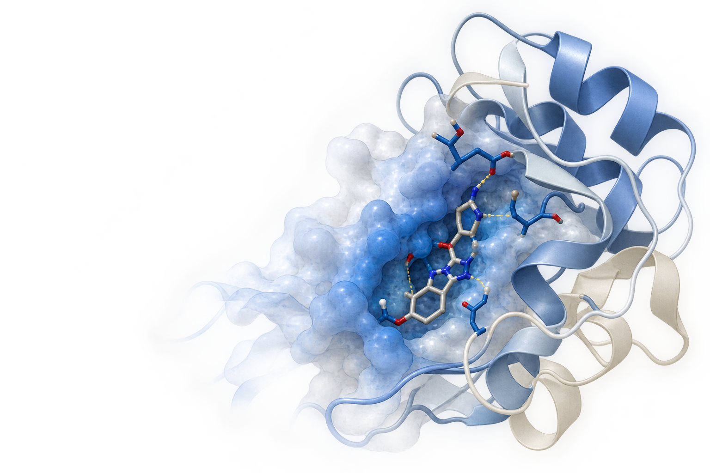

  <h1 align="center">Serena Rosignoli, PhD</h1>
  
<strong>Computational Biologist · Research Software Engineer</strong>

  <i>A computational approach to biological modelling, scientific software, and AI.</i>

  <a href="mailto:serena.rosignoli@unimore.it">Email</a> ·
  <a href="https://www.linkedin.com/in/serenarosignoli97/">LinkedIn</a> ·
  <a href="https://scholar.google.com/citations?user=tFQ9tMAAAAAJ&hl=it">Google Scholar</a>

  Post-Doctoral Research Fellow · Centre for Regenerative Medicine “Stefano Ferrari” · University of Modena and Reggio Emilia

---

## Abstract

My work spans **molecular simulation, protein engineering, structural bioinformatics and machine learning**, with a particular interest in making computational models **interpretable, reproducible, and useful to experimental scientists**.

  <i>Structural Biology · Scientific Software · Molecular Modelling · Machine Learning · AI for Molecular Systems</i>

---

# 1. Introduction

Biological research increasingly relies on computational approaches to represent, model and analyse complex biological systems.

I work across different levels of biological representation, from **molecular structures and sequences to computational and machine-learning models**, developing both the methods and software needed to study them.

This perspective connects my work in structural bioinformatics, molecular simulation, protein engineering and AI.

 

---

# 2. Methods

## Biological systems

**Proteins** · **Nucleic acids** · **Molecular interactions** · **Genome editing**

## Computational approaches

**Structural bioinformatics & molecular modelling**  
Protein modelling · Molecular docking · Molecular dynamics · Structural analysis

**Machine learning & deep learning**  
Deep learning · Geometric deep learning · Protein language models · Sequence-based models · Molecular representations · Explainability

**Protein engineering**  
Computational design · Sequence analysis · Structure-based analysis

## Scientific software

I develop and integrate computational methods across different stages of biological research, from molecular modelling and simulation to machine learning and scientific software. My work includes both methodological development and the implementation of practical workflows for biological applications.

**Programming & development:**  
Python · C++ · JavaScript · Git · Linux

**Molecular modelling:**  
PyMOL · Rosetta · OpenMM · GROMACS · MODELLER

**Machine learning:**  
PyTorch · PyTorch Geometric · DGL · ESM

**Biological & structural data:**  
PDB · UniProt · ChEMBL · BindingDB · KLIFS

---

# 3. Results

### PyMod

**Protein modelling and structural bioinformatics within PyMOL.**

A platform integrating sequence analysis, structure prediction, homology modelling and structural analysis into a graphical molecular-modelling environment.

`workflow design` · `tool integration` · `data handling` · `GUI development` · `automation`

[Repository](https://github.com/pymodproject/pymod)

---

### DockingPie

**Molecular docking workflows within PyMOL.**

A plugin-based environment for integrating and automating different docking protocols through a unified graphical interface.

`plugin architecture` · `CLI integration` · `I/O standardisation` · `GUI workflows` · `automation`

[Repository](https://github.com/paiardin/DockingPie) · [Publication](https://doi.org/10.1093/bioinformatics/btac452)

---

### PyPCN

**Protein structural analysis through contact-network representations.**

A PyMOL plugin for constructing and analysing protein contact networks directly from molecular structures.

`structural parsing` · `network construction` · `graph-based analysis` · `visualisation`

[Repository](https://github.com/pcnproject/PyPCN) · [Publication](https://doi.org/10.1093/bioinformatics/btad675)

---

### AlPaCas

**A computational framework for allele-specific CRISPR/Cas design.**

A web server and computational pipeline for designing allele-specific genome-editing strategies, from mutation analysis to guide ranking and selection.

`sequence analysis` · `scoring` · `web server` · `gene editing`

[Publication](https://doi.org/10.1093/nar/gkae419)

---

### G4REP

**Deep learning for RNA G-quadruplex-binding protein prediction.**

A sequence-based framework for predicting human proteins associated with RNA G-quadruplexes using deep-learning models.

`protein classification` · `ESM embeddings` · `deep learning`

[Publication](https://doi.org/10.1093/bioinformatics/btag088)

---

# 4. Discussion

Computational models are becoming increasingly powerful in biology, but predictive performance alone does not determine whether a model is useful to scientists.

My work increasingly focuses on the connection between **biological representation, computational models and biological interpretation**: understanding how molecular information is encoded, what models learn from these representations, and how computational methods can be made reproducible and practically useful.

---

# 5. Future Perspectives

### Virtual Kinome Assay (VKA)

A current research direction is the development of **structure-informed deep-learning methods for molecular recognition and drug discovery**, with a focus on kinase selectivity.

The **Virtual Kinome Assay (VKA)** is a framework designed to predict compound–kinase binding affinity across the human kinome by combining curated kinase structures, molecular docking and **geometric deep learning**. The aim is to provide a fast and scalable complement to experimental kinome profiling, while making predictions informative beyond a single affinity score.

A central component of the project is **interpretability**: gradient-based explainability methods will be used to identify the regions of kinase–ligand complexes that contribute most to predicted affinity, helping connect model predictions with molecular interactions, potency and selectivity.

`kinome profiling` · `molecular docking` · `geometric deep learning` · `binding affinity` · `interpretable models`

### DYNAMITE: N-Myc-selective protein design and targeted degradation

A second research direction focuses on **AI-assisted protein design for selective targeting of difficult protein interfaces**.

DYNAMITE aims to engineer a peptide that selectively recognises N-Myc while discriminating against the highly similar interfaces of c-Myc, L-Myc and MAX. The designed binder will form part of a peptide PROTAC intended to promote targeted N-Myc degradation in MYCN-amplified neuroblastoma.

The computational framework combines structural information, AI-driven inverse protein design and negative design, with biochemical and cellular experiments feeding back into successive design cycles. **Explainable methods are integrated into the design process to identify the molecular determinants of selective recognition and generate experimentally testable mechanistic hypotheses.**

`protein design` · `inverse folding` · `negative design` · `deep learning` · `explainability` · `targeted degradation`

---

# 6. Conclusions

You've made it this far, so I think we can conclude that **computational biology, scientific software, molecular modelling and AI** are probably of some interest to you.

If you are working on something related, have an idea to discuss, or simply want to exchange thoughts, **do not hesitate to get in touch.**

[Email](mailto:serena.rosignoli@unimore.it) · [LinkedIn](https://www.linkedin.com/in/serenarosignoli97/)

## Supplementary Information

### Teaching & learning resources

Selected material from lectures, workshops and computational biology training.

### Computational utilities

Scripts and tools for bioinformatics, structural analysis, molecular modelling and scientific workflows.

---

<i>Data and code availability:</i> selected projects and scientific software are available through the repositories linked above.
